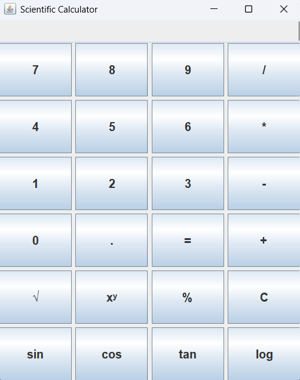

# Scientific Calculator

A simple Scientific Calculator built with Java Swing.

## Screenshot



## Features

- Basic operations: Addition, Subtraction, Multiplication, Division
- Scientific functions: sin, cos, tan, log, square root, power (xʸ)
- Modulus (%) support
- Error handling for divide by zero and invalid inputs
- Clean GUI with a responsive button layout


## Requirements

- Java JDK 8 or above

## How to Run

1. Clone the repository
```bash
   git clone https://github.com/aditya-patra1011/Scientific-Calculator-.git
```

2. Navigate to the project folder
```bash
   cd Scientific-Calculator-
```

3. Compile the code
```bash
   javac ScientificCalculator.java
```

4. Run the program
```bash
   java ScientificCalculator
```

## Project Structure
```
Scientific-Calculator-/
│
├── ScientificCalculator.java   # Main source file
└── Scientific_Calculator.png   # Project screenshot
```

## How to Use

1. Enter a number using the buttons
2. Press an operator (+, -, *, /)
3. Enter the second number
4. Press `=` to see the result
5. Press `C` to clear the display

> For sin, cos, tan and log — enter the number first, then press the function button directly.

## Author

**M. Aditya Patra**  
GitHub: [@aditya-patra1011](https://github.com/aditya-patra1011)

## License

This project is open source and free to use.
